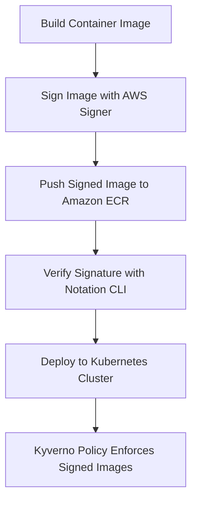

# Image Signing in AWS  

Container image signing, verification, and attestation with AWS Signer, Notation CLI, Amazon ECR, and Kyverno.  

## Overview  

This project demonstrates how to sign container images with AWS Signer, push them to Amazon ECR, verify their signatures using the Notation CLI, and enforce signature policies in Kubernetes with Kyverno. It showcases a secure supply chain workflow for containers on AWS.  

## Key Features  

- **Signing images** – Use AWS Signer to create cryptographic signatures for container images.  
- **Publishing to ECR** – Store and manage signed images in Amazon Elastic Container Registry (ECR).  
- **Verification with Notation** – Verify image signatures locally and in Kubernetes clusters using the Notation CLI.  
- **Policy enforcement** – Employ Kyverno policies to ensure only signed and trusted images run in your clusters.  
- **End‑to‑end demo** – Includes scripts and instructions to set up a signer profile, sign images, verify them and enforce policies.  

## Contents  

- `/scripts/setup-signer/` – Scripts to create a signer profile and prepare AWS resources.  
- `/scripts/sign-image/` – Example commands to sign container images.  
- `/scripts/verify-image/` – Scripts demonstrating how to verify image signatures using Notation.  
- `/policies/kyverno/` – Sample Kyverno policies for signature enforcement.  
- `/docs/` – Additional documentation and guides.  

## Getting Started  

Follow the steps below to reproduce the workflow:  

1. Set up your AWS Signer profile and grant necessary IAM permissions.  
2. Build your container image locally and push it to ECR.  
3. Sign the image using AWS Signer.  
4. Use the Notation CLI to verify the image signature.  
5. Deploy Kyverno in your Kubernetes cluster and apply the provided policies to enforce signed‑image checks.  

## License  

This project is licensed under the MIT License.

## Architecture Diagram  

