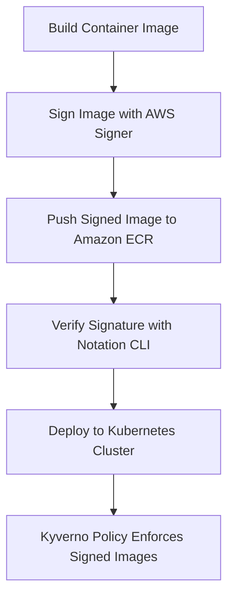

# Image Signing in AWS **Container image signing, verification, and attestation with AWS Signer, Notation CLI, Amazon ECR, and Kyverno**  
  
[](https://aws.amazon.com/security-lake/) [](https://schema.ocsf.io/) [](https://github.com/features/actions) [](https://stratus-red-team.cloud/) [](LICENSE)  
  
## Overview  
  
This project demonstrates an **end-to-end container image signing and verification workflow** using:  
- **AWS Signer** – to generate and manage cryptographic signatures for container images  
- **Amazon ECR** – to store and distribute signed container images  
- **Notation CLI** – to verify container image signatures locally and within Kubernetes clusters  
- **Kyverno** – to enforce policies ensuring that only signed and trusted images can be deployed  
  
It showcases a **secure software supply chain** on AWS, from image build to policy enforcement in Kubernetes.  
  
## ️ Architecture  
  

  
Each step builds on AWS-native and open-source tooling to create a verifiable chain of trust.  
  
## Repository Structure  
  
```  
image-signing-in-aws/  
├── README.md  
├── docs/  
│   ├── overview.md  
│   ├── setup.md  
│   ├── verify.md  
├── scripts/  
│   ├── setup-signer/  
│   │   └── create-signer-profile.sh  
│   ├── sign-image/  
│   │   └── sign-with-aws-signer.sh  
│   └── verify-image/  
│       └── verify-with-notation.sh  
├── policies/  
│   └── kyverno/  
│       ├── require-signed-images.yaml  
│       ├── verify-signed-images.yaml  
│       └── clusterpolicy.yaml  
└── LICENSE  
```  
  
## ⚙️ Prerequisites  
  
- AWS CLI configured with IAM permissions for AWS Signer and ECR  
- Docker or Podman installed locally  
- Notation CLI ([install guide](https://notaryproject.dev/docs/installation/))  
- A running Kubernetes cluster  
- Kyverno installed ([kyverno.io](https://kyverno.io/docs/installation/))  
  
## Getting Started  
  
### 1️⃣ Set up AWS Signer Profile  
  
```bash  
aws signer put-signing-profile \  
  --profile-name my-container-signer \  
  --platform-id AWSLambda-SHA384-ECDSA  
```  
  
### 2️⃣ Build and Push Your Image to ECR  
  
```bash  
docker build -t <account-id>.dkr.ecr.<region>.amazonaws.com/demo-app:latest .  
aws ecr get-login-password --region <region> | docker login --username AWS --password-stdin <account-id>.dkr.ecr.<region>.amazonaws.com  
docker push <account-id>.dkr.ecr.<region>.amazonaws.com/demo-app:latest  
```  
  
### 3️⃣ Sign the Image  
  
```bash  
notation sign <account-id>.dkr.ecr.<region>.amazonaws.com/demo-app:latest \  
  --plugin com.aws.signer.notation.plugin \  
  --id my-container-signer  
```  
  
### 4️⃣ Verify the Signature  
  
```bash  
notation verify <account-id>.dkr.ecr.<region>.amazonaws.com/demo-app:latest  
```  
  
### 5️⃣ Apply Kyverno Policies  
  
```bash  
kubectl apply -f policies/kyverno/require-signed-images.yaml  
kubectl apply -f policies/kyverno/verify-signed-images.yaml  
```  
  
## Kyverno Policy Example  
  
```yaml  
apiVersion: kyverno.io/v1  
kind: ClusterPolicy  
metadata:  
  name: verify-signed-images  
spec:  
  validationFailureAction: enforce  
  background: false  
  webhookTimeoutSeconds: 30  
  rules:  
    - name: verify-image-signature  
      match:  
        any:  
          - resources:  
              kinds:  
                - Pod  
      verifyImages:  
        - image: "<account-id>.dkr.ecr.<region>.amazonaws.com/*"  
          keyless:  
            issuer: "https://signer.aws.amazon.com"  
            subject: "my-container-signer"  
```  
  
## Example End-to-End Demo Flow  
  
1. Create the signer profile (`scripts/setup-signer/`)  
2. Build and push your container image to ECR  
3. Sign the image (`scripts/sign-image/`)  
4. Verify the signature locally (`scripts/verify-image/`)  
5. Deploy to a Kubernetes cluster  
6. Enforce Kyverno policies to allow only verified images  
  
## Step-by-Step Instructions  
  
Follow these steps to sign and verify your container images with AWS Signer, Amazon ECR, Notation CLI, and Kyverno.  
  
1. **Set up your AWS Signer profile** – Use the AWS CLI to create or select a signing profile for container images.  
2. **Build your container image** – Build your container image locally using `docker build` (or Podman).  
3. **Push the image to Amazon ECR** – Authenticate to ECR and push the built image using `aws ecr get-login-password` and `docker push`.  
4. **Sign the image with Notation** – Use the Notation CLI with the AWS Signer plugin to sign the image:  
  
    ```bash  
    notation sign <account-id>.dkr.ecr.<region>.amazonaws.com/demo-app:latest \  
      --plugin com.aws.signer.notation.plugin \  
      --id my-container-signer  
    ```  
  
5. **Verify the image signature** – Verify the signed image using Notation:  
  
    ```bash  
    notation verify <account-id>.dkr.ecr.<region>.amazonaws.com/demo-app:latest \  
      --plugin com.aws.signer.notation.plugin  
    ```  
  
6. **Deploy to Kubernetes with policy enforcement** – Apply the Kyverno policies in the `policies/kyverno` directory to your Kubernetes cluster to ensure that only signed images are deployed.  
  
## License  
  
This project is licensed under the [MIT License](./LICENSE).  
  
## References  
  
- [AWS Signer Documentation](https://docs.aws.amazon.com/signer/latest/developerguide/Welcome.html)  
- [Notation CLI Docs](https://notaryproject.dev/docs/)  
- [Kyverno Policies Reference](https://kyverno.io/policies/)  
- [Nirmata kyverno-notation-aws](https://github.com/nirmata/kyverno-notation-aws)  
- [AWS Blog: Simplify container signing with AWS Signer and Notation](https://aws.amazon.com/blogs/containers/simplify-container-image-signing-with-aws-signer-and-notation/) 
